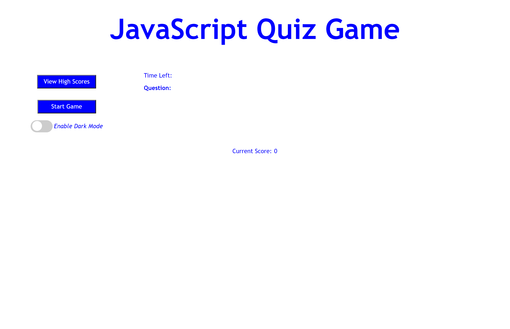
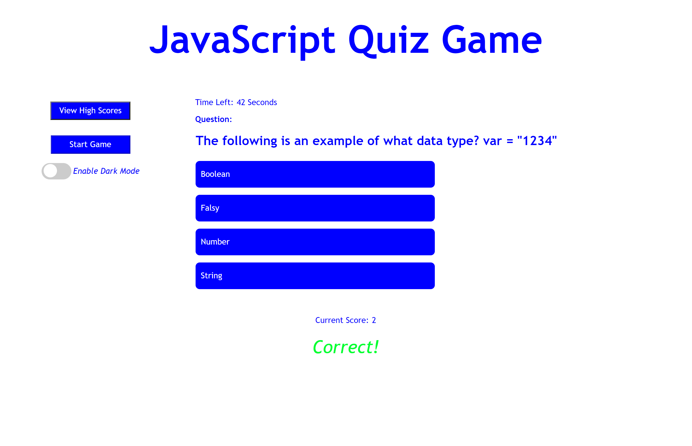
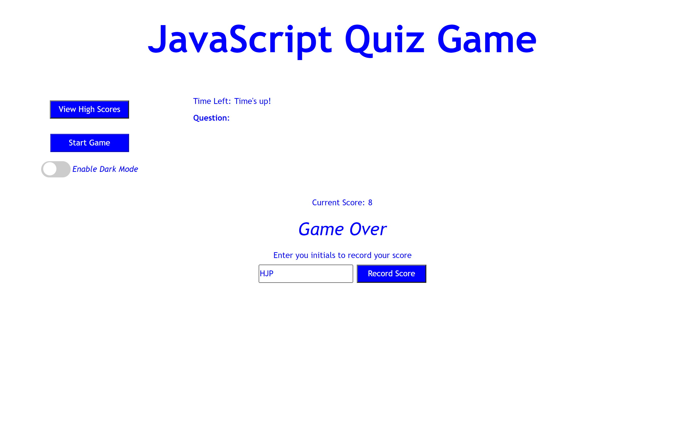

# quiz-webgame

## Description

As a coding boot camp student i want to take a timed quiz on JavaScript fundamentals that stores high scores so that I can gauge my progress compared to my peers.

Creating this quiz will reenforce JavScripts basics and use web APIs to access local storage.

## Usage

Visit [the JavaScript Quiz Website](https://wmr89.github.io/quiz-webgame/) to load the webpage.

Dark mode can be enabled by using the "Enable Dark Mode" toggle switch

Click "Start Game" and the game will display questions and start the timer. Click on an answer and the quiz will display "Correct!" or "Wrong!". If you are correct a point will be added to your score. If you are wrong then 5 seconds will be deducted from your remaining time.

When the time runs out or the questions are all complete the game will display "Game Over" and provide an input box where you can enter your initials and record your score.

## Credits

Code Tutorial for Light mode/Dark Mode Toggle Switch

https://dev.to/ananyaneogi/create-a-dark-light-mode-switch-with-css-variables-34l8

## License

See LICENSE in the repo

---